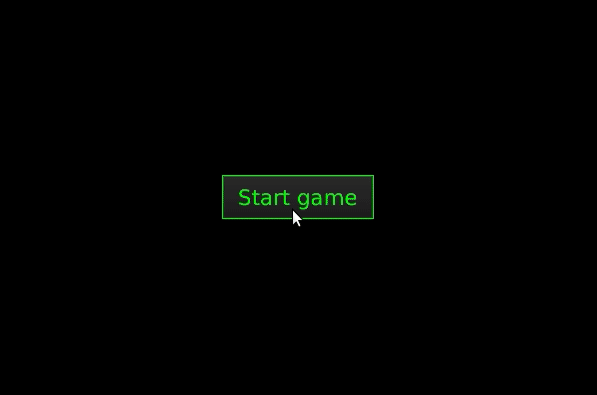
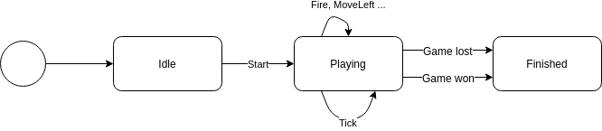
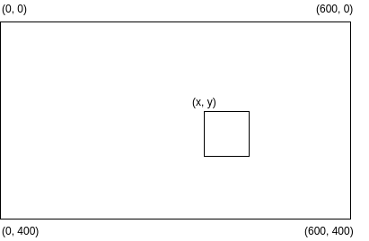
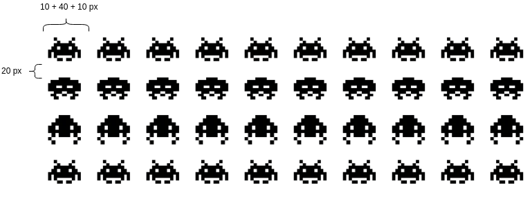

# Space invaders actor workshop



In this workshop we will complete a simplified version of the classic game Space Invaders, as shown above. While we are making the game work, you will get experience with how Akka actors work, their lifecycle, how to change their behaviour, and different ways to send messages to other actors.

The GUI part is already there, but it isn't doing anything yet, our task will be to finish the game logic which uses a hierarchy of actors to manage updates and keep track of the game state.


The game loop is driven by a scheduled message `Tick` which is sent to the main `Game` actor 20 times per second, and `Game`'s main task is to send a `GameStateDto` to the `GUI`.

There are probably many ways to organize the actors and still get a working game. We have chosen to have a quite clean communication interface between the `GUI` and the `Game`; `GUI` can send `Start`, `MoveLeft`, `MoveRight` and `Fire` to `Game`, and `Game` only sends `GameStateDto` back to the `GUI`.

`GameStateDto` is an object that contains a complete view of the current state of the game, and the different parts of our actor hierarchy is responsible for providing different parts of it to the `Game` actor, which collects the parts and sends the total picture to the `GUI` actor.

Communication between other actors mainly occurs between a parent and its children. This approach gives only one entry point between the GUI and the game logic, which makes it easy to have full control over when the game is active, or ended and all the moving parts have to stop. The global `Tick` makes it easy to handle speed, and also the aliens move in a synchronized way, so they can act entirely on their own. 


Below are detailed instruction that gradually will make the game work. You can either follow them, or if you want, you can go more "free style" and make the actor system as you like, as long as the `GUI` actor receives the game state as specified in `GameStateDto` it should still work.

## A very tiny quick guide to Akka
Here is a very short summary of the Akka and actor basics you might need for the workshop. You can skip it for now and get back to it if you don't find the answer in the task description. And also, a much better place to look is in the real [Akka documentation](https://doc.akka.io/docs/akka/current/index.html)!

An **Actor** receives messages, creates other actors, have its internal state, and lives in a hierarchy of actors in an actor system. An actor inherits the class `AbstractActor`, and contains the following important methods
*  `getSelf()` - `ActorRef` to itself                         
* `getSender()` - `ActorRef` to the currently processed message 
* `getContext()` - the actor context

The **Context** gives contextual information for the actor, like `getChildren()`, `getParent()` and `getSystem()`.  Actors are often created from another actor's context with `getContext().actorOf()`, and the new actor will then be a child of that actor. The constructor of an actor is not used directly, instead each actor class should have a static method returning [`Props`](https://doc.akka.io/docs/akka/current/actors.html#recommended-practices) for its own instantiation. `Props` are created with `Props.create(<MyClass>.class, () -> new <MyClass>(args))`. 

When an actor is created you get hold of an `ActorRef`, which is your reference to the actor and everything you need to send messages to that actor. The `ActorRef` can safely be contained in messages sent to other actors, and it is a common way to introduce an actor to another.

A **Message** can be sent to an actor by invoking the `ActorRef`'s `tell` method. The first argument is the message and the second is the `ActorRef` of the sender, often `getSelf()`. If you just want to forward a message, you can instead use `forward`, which will keep the original sender. It is a good thing to create a message as static inner classes of the actor that will receive that message. 

The **receiving** of messages in an actor is defined in the `createReceive()` method that all actors have to implement. The `Receive` object is created with a `receiveBuilder()`, which is build up by adding a `match` for each message type the actor should respond to, like `receiveBuilder().match(<MyMessage>.class, msg -> {}).build()`. 

The actor can behave like a state machine, by defining different states in terms of `Receive` objects, where different `Receive`s can respond to different messages, or respond differently to the same message. The transition from one `Receive` to another is called **become**, and within one `Receive` one can move to the next state by invoking `getContext().become(<NextReceive>)`. The `createReceive` method should return the first state of the actor.

## Getting started
To do this workshop you should have the following installed on your computer:
* [Java JDK](https://www.oracle.com/technetwork/java/javase/downloads/index.html) version >= 10
* [Maven](https://maven.apache.org/)
* A nice editor, like [IntelliJ](https://www.jetbrains.com/idea/)

Clone (or download) this repo, and open the project in your editor. The editor probably knows how to run the project from the main class `App.java`. The code can also be built and run from command line with
```
mvn clean install
java -jar target/actor-invaders-1.0-SNAPSHOT-uber.jar
```

If you see a black screen with a start button when running the application, you are good to go!

## Task 1: Let the game begin
The actor `Game` is the main actor. It will receive messages from the `GUI` actor and the message scheduler, and create and organize actors for handling the player, the aliens, and the bullets, and send new game state back to the `GUI`.
Initially `Game` has five message types; `Tick`, `Start`, `Fire`, `MoveLeft` and `MoveRight`. (We will add more later, and it will receive DTO objects as messages) 

The first message is the one that gets the game going. At every `Tick` the current game state is sent to the `GUI` actor. `Start` is received when the user clicks the "Start game" button, and should move `Game` into an active state. When the `Game` is in active state it should response to the commands `Fire`, `MoveLeft` and `MoveRight` from the player, and `Tick` from the scheduler.



Instead of having conditionals and flags to decide whether the actor should react to the different messages or not, it will be better to keep the states clean and separate from each other. For that we will use the [`become`](https://doc.akka.io/docs/akka/2.5/actors.html) functionality to move between the states.
* In the `Game` actor make two methods that both return `Receive` objects, one for when the game has not yet started, and one for when the `Game` is playing, you can for instance call them `getIdle` and `getPlaying`.
  * `Receive` objects is made with `receiveBuilder()`. Add a `.match()` for each message that should be received, and finally `.build()` to get the `Receive`.
* The idle `Recieve` should only react to `Start` messages, and when it receives such a message it should create the `Player` actor, and then become the playing `Receive`.
  * The player actor can be created by `getContext().actorOf(Player.props(), "player")` You are in the context on the `Game` actor, so the player actor will be a child of the `Game` actor, with the name "player". 
  * You might want to save the player actorref in an instance variable so you have it for later
  * Maybe you also want to log that the game has started, so you really know. There is a `log` instance member use can use for that.
  * Finally, the `Game` should move on to playing state. That is achieved with `getContext().become()`.
* The second, the playing `Receive`, should *not* react to `Start`, but the other messages. 
  * When it receives `Tick` it should tell the `GameStateDto` to the GUI actor. The way to tell something to an actor is to use the `tell` method on an `actorRef` like `guiActor.tell(new GameStateDto(...), getSelf()))`. The bullets and aliens can just be empty lists for the time being. The `playerDto` is available as an instance variable, but it is immutable and thus safe to give away, the state can be `GameStateDto.State.Playing`.
  * The messages `MoveLeft` and `MoveRight` can be told further to the `Player`, and we will work with the player in the next session. (We will come back to `Fire` later).
* Make sure that the `createReceive()` method returns the receiver for the idle state.
* Start the application and see that you can click the start button and then is showed an empty, black screen. (Yeah, really exciting!)

## Task 2: Make the player move
Let us get the player into action! Both the player and the aliens are represented by images on the game screen. The screen has fixed size of `600 × 400` px, where `(0, 0)` is the upper left corner, and the position of an image is given by the coordinates of the image's upper left corner.



The `Player` is the actor for the state of actual player's cannon in the game, and it keeps its current position (`posX`, `posY`) and the remaining number of `lives` as its state variables. Every time the player move it will send a `PlayerDto` to its parent actor `Game` (and the `Game` will include that dto as a part of a `GameStateDto` at every `Tick`). 

* We will need to be able to make a `PlayerDto` quite often, so we can probably just create a method that makes one, and returns it. There is already a constant `image` that can be used as argument to the `PlayerDto`s constructor.
* Somewhere in the `Player` we should set the initial position for the cannon, it can be done in the constructor or just set the values where the instance variables are declared. A normal position would be in the middle, at the bottom of the screen. There are constants in the `Player` containing the screen size, which can be used in the calculation. We should also immediately send a `PlayerDto` back to the `Game`. The `Player` actor is a child of `Game`, so we can use `getContext().parent()` to get hold of the `Game` actorRef.
* In the `Player`'s `createReceive` add matches in the builder for the `Game.MoveLeft` and `Game.MoveRight` messages. In the action function in the match we should update `posX`. Experiment with what number you feel is a good speed, it can be 5. Add the speed to `posX` if the player moves right, and subtract if it moves left. Maybe you also want to stop the player from moving outside the screen? A `PlayerDto` should also be sent back to the `Game`.
* In `Game` we should receive the `PlayerDto` and update the instance variable.
* Start the game and see that you can move the player with the left and right arrows.

## Task 3: Firing bullets
There are many ways to think about the bullets and how they should be modelled in the system. Are they owned by the object firing them, or do they live separately from the object creating them? Here we will let the bullets live separate from the object triggering the creation of them. But we need some bookkeeping to be able to deliver a list of current bullets and their positions to the `GUI` actor. We will terminate bullets when they move outside the screen or when they hit another object. Thus, we will also make a `BulletManager` to keep track of the total set of bullets in the game. The bullets themselves are tiny actors that keep track of their own position, and stop themselves if they move outside the screen.

### The Bullet
The `Bullet` actor has three private fields; an `id`, and the position `posX` and `posY`. The `id`  is useful for more effective updates of the `GUI`, and also the actor name has to be unique, so the id will be appended to the name when the bullets are created. The `posX` is never updated, the bullets move in straight lines. We will have two types of bullets, those fired by the player, and those fired by the aliens, but for now we will only think of bullets as fired from the player and moving upwards.
* Make a constructor in the `Bullet` that takes the in the three fields `id`, `posX` and `posY`, and sets the matching private fields. Add a static `props` method, that takes in the same three fields, and returns the props with `Props.create`.
* In the receive builder we will match for the `Tick` message.
  * Update the `posY` of the `Bullet`. Again, pick a suitable number, 10 might be the number.
  * If `posY` is outside the screen, we will stop the bullet. There are [several ways of stopping](https://doc.akka.io/docs/akka/2.5/actors.html#stopping-actors) an actor, depending on what needs to be done when an actor stops. We can just go for the simple `getContext().stop(getSelf())`.
  * Otherwise, if the bullet it not outside the screen, we should create a `BulletDto` and tell that back to the message sender (which should be the same as the parent). The sender in the `BulletDto` should be `BulletDto.Sender.Player`.

### The BulletManager
The `BulletManager` will create new bullets and keep track of the `BulletDto` it receives. On every tick it will send the tick further down to each bullet, and send the current list of `BulletDto`s back to `Game`. Note that the manager will not need to wait for the bullets to update their position before it sends the list of dtos back to the `Game`. It just happily send the current situation, so the updates from the `Bullet` actors will take effect in a later tick.
* Create a static props method for the `BulletManager`. It does not need any arguments, and we don't need to make a constructor either.
* The manager needs a new message type for telling it to make new bullets. Make an inner static class for this message, it might be called `CreateBullet`, and it should take two arguments, the x- and y-coordinate of the position where the bullet should be created.
* We need some structure to keep order in the set of bullets. The manager already got a `refToBullet` for that, which can be used to store the `BulletDto`s it receives from the `Bullet`actors. You can of course use other structures for the bookkeeping if you'd like.
* The `receiveBuilder` should have matches for `CreateBullet`, `Tick`, `BulletDto` and `Terminated`. The last message is a special one that comes from the lifecycle monitoring in Akka. Any actor can `watch` any other actor, and if the watched actor stops, a `Terminated` message is sent to the watcher. 
  * When the manager receives a `CreateBullet` it should create a `Bullet` actor, start watching it by calling `getContext().watch(bullet)`. There is an instance variable `nextId` that can be used for setting the id and incremented afterwards. The id should also be a part of the actor name when bullet is created.
  * When the `Tick` message is received the manager should send the `Tick` further to all the bullets, and send the bulletDtos of `refToBullet.values()` back to `Game`. The `BulletManager` can get hold of all the bullets by using `getContext().getChildren()`. Create a new message type in `Game` for receiving the list of `bulletDto`s, it could be called `Bullets`. To make sure that we do not share mutable state out, the list of bullets should be put in a new list, it should even be in a `Collections.unmodifiableList`.
  * On `BulletDto` messages it should just put the sender of the message and the dto in the `refToBullet`.
  * When a `Bullet` stops, the manager receives a `Terminated` message. The message has a `getActor()`that will give the `ActorRef` of the stopped actor. The manager should remove this stopped bullet from the `refToBullet`.

### The Player
The `Player` needs to be responsible for firing its own bullets, also because the start position of the bullet depends on the current position of the `Player`. The `Player` doesn't know about the `BulletManager`, but it can get to know it by including the manager in messages sent to the `Player`.
* Make a new message type in the `Player` class, for instance called `Fire`, which has an `ActorRef` for the `BulletManager` as an instance member.
* Add a new match in the receiveBuilder that matches on this new `Fire` message. When such a message is received the `Player` should tell the actorRef in the message to `CreateBullet`.


### Putting the pieces together
Now we should have all the pieces we need to fire bullets, we only have to put them together in the `Game` actor.
* Create a `BulletManager`, and keep a reference for it. It can for instance be created when the `Start` message is received.
* In the `playing` state of the actor, add a match for the `Fire` message. When this message is received, the actor should tell the `Player` the fire message we made in the `Player` class, where a reference to the `BulletManager` is added.
* In the same state it should also add a match for its `Bullets` message. When it receives this, it should keep the list of bullets inside the message in an instance variable. 
* In the `Tick` match where the `GameStateDto` is sent to the `GUI`, the list of bullets in the previous step should be added. The `Tick` should also be sent down to the `BulletManager`.
* Start the game and see that the player now can fire bullets, by pushing space. Well done!

## Task 4: Organize the aliens
You can of course organize the aliens and have as many of them as you like, below are instructions to make the aliens appear as shown in the gif.

The aliens are organized in a grid of 4 × 10 aliens, where bullets are fired randomly from one of the columns where there still are aliens left. The aliens all has a width of 40 px, and can be evenly distributed on a screen of width 600 with 20 pixels between the aliens, in all directions.



### The Alien
The `Alien` actor keeps track of its current position, and its current image, since the aliens alternate between two images. It also needs some logic for moving to the right for some time, then move to the left, and then back again, and for alternating the images.
* Add a constructor and a static `props` method that takes integers `id`, `posX`, `posY`, and an imageSet of type `AlienImageSet`, and make (and set) corresponding private fields. The alien also needs to keep track of its current image, which can be initialised by the `getFirst()` of `AlienImageSet`.
* Add matches in the receiveBulder for `Tick`. On `Tick` the alien should move, and then send  an `AlienDto` message to its parent. Some logic is needed for moving first right, then left, and then to the right again, and to alternate between the two images, the method `getOther` in `AlienImageSet` can be useful for switching the image.
  * An easy approach can be to just keep two internal counters which are incremented until some limit is reached, one for how many ticks there should be between each time the alien move, and one for how many moves the alien should make before it changes direction. When the first counter reach its limit; change image, move, reset counter and increase the moves counter, otherwise just increase the counter. Then check if the limit of the move counter is reached, if so, change direction and reset the counter to the negated of the initial value.

### The AlienManager
The `AlienManager` has some similarities with the `BulletManager`, it creates all the `Alien` actors, and watch them so that it can remove dead aliens. The manager receives `AlienDto` messages from aliens, and sends a current list of `AlienDto`back to `Game` at each `Tick`.
* Make a constructor and static `props` method. Both should take an `ActorRef` for the `BulletManager` as argument.
* The grid of aliens can be initialized in the constructor
  * Use for instance a double for loop, and add actorRefs to the manager's grid variable.
  * Use the three different image sets defined in `AlienImageSet` so that aliens on same row has the same image, and the rows alternates between different images.
  * You can use the `getHeight()` of the imageSet to calculate the y coordinate for the next row
  * The aliens should be watched by the manager
* The manager should respond to messages of type `Tick`, `AlienDto`and `Terminated`
  * On `Tick` the manager should tell all its children, the aliens, to tick, and send the list of `AlienDto`s back to the game. You might want to create a new message type for that in `Game`, and we should also add a corresponding match for that message which saves the aliens in `Game`'s instance variable `aliens`.
  * When `AlienDto` is received, the manager should update the `refToAlien` map.
  * When `Terminated` is recieved, the dead alien should be removed from all the places it is kept in instance variables.

### The Game
In `Game` create the `AlienManager`, and send `Tick` also to the `AlienManager`. We you start the application now you should have marching aliens in your game, but the aliens are still very harmless.

## Task 5: Oh no, the aliens attack
We will now make sure that bullets are fired randomly from one of the columns in the alien grid where there still are aliens left. The bullet should then be fired from the lowermost alien in that column.

### The Alien
* Make a new message type similar to the one we made for the `Player`. It can be called `Fire` and should take a `BulletManager` actorRef as constructor argument.
* Add matches in the receiveBuilder for `Fire`. On `Fire` the `Alien` should tell `CreateBullet` to the bulletManager. The `AlienImageSet` has getters for height and width that might be useful for centering the position of the bullet.

### The AlienManager
* On `Tick` the `AlienManager` should decide if it wants to fire a random bullet. It is perhaps nice to have a separate method for firing the bullet, and the method should randomly choose one of the lowermost aliens from each column (if the column still has aliens left), and tell the selected `Alien` to `Fire`. 
* You probably don't want to fire a bullet at every `Tick`, then it feels like it's raining bullets. 
 
### The Bullet and the BulletManager
Now the `BulletManager` will receive `CreateBullet`messages from two different senders; from the `Player` and from the `AlienManager`. It therefore needs to create two different kinds of bullets, one with sender player which are moving upwards, and one with sender alien which is mowing downwards. 
* Decide what you want to do with the `Bullet` actor in order to create bullets of these two kinds. Maybe you want to make it into an abstract base class with two sub classes, one for each bullet type, or maybe just separate the different logic inside the same class by using the existing enum in `BulletDto`, or something else.
* The `BulletManager` should then be responsible for creating a `Bullet` with the right properties. But how can it know which type of `Bullet` it should make? Again there are choices. The manager can use the name of the sender of the `CreateBullet` message to deduce what `Bullet` it should make, or we can extend the `CreateBullet` message to contain information that can be used to decide. In the first case the `BulletManager` is in control of what kind of bullets it wants to make, in the latter, the sender of the message controls the decision. To get hold of the name of the sender you can invoke `getSender().path().name()`.

Now there also should be bullets fired from aliens when you run the application.


## Task 6: it's a war!
We are actually pretty close to something that behaves like a game! 

The main remaining part is to detect when the player or the aliens are hit by bullets. If the player is hit it should lose a life, and if there are no lives left, the game is lost. When an alien is hit it should be removed, and if there are no aliens left the game is won. When a bullet hits something it should disappear from the screen.

Obviously we need a way for the player and aliens to figure out when they are hit by bullets. The player and the aliens know their own widths and heights, so it is practical to let those entities decide if they are hit by a bullet or not. But we might not want the entities to keep a list of references to the bullets, which also are continuously created and removed, or for a bullet to have a list of the entities, since these objects are not directly related in our actor hierarchy. But there is another way; the [Event Bus](https://doc.akka.io/docs/akka/current/event-bus.html). We will let the entities subscribe to bullets, and take the right action if they are hit. One can make a dedicated event bus, but we will just use the main bus for the actor system, the Event Stream.

In the class `Events` there are two events, one for when a bullet fired from an alien, and one for when a bullet is fired from the player. We will let the player subscribe to `AlienBulletMoved` and aliens subscribe to `PlayerBulletMoved`

* Start by making bullets publish the right message on the event stream each time they move. It is done by invoking `getContext().getSystem().getEventStream().publish()`. Messages published on the event stream does not have its original sender, that is why the actorRef for the bullet is included in the message.
* When the `Player` is created, it should also start to subscribe for `AlienBulletMoved` messages, and have a match clause for such messages in its receive builder. To make the player subscribe to the messages we can use `getContext().getSystem().getEventStream().subscribe(playerActorRef, AlienBulletMoved.class)`. If the position of the `BulletDto` is within the area occupied by the player, the player should lose one life, and also stop the bullet actor. 
* Similar with the aliens. They should subscribe to the `PlayerBulletMoved` message, and stop both itself and the bullet when it is hit by the bullet. 
* Now we only have to update the state in `Game`. We should update the GUI with state `gameWon` if there are no aliens left, and similar `gameLost` if `Game` receives a `PlayerDto` with no lives left. You can choose if you want the logic for this in `Game` or if you want the `Player` and `AlienManager` tell the `Game` when those things happen. To make everything stop when the game is either won or lost, we can make a new receive method for game over, and then let the `Game` become game over.

<p align="center">
  :tada: <b>Congratulations! You did it!</b> :tada:
 </p>

## Bonus tasks

### Bonus task 1: Akka remoting

Do you want to see how easy it is for actors to communicate with remote actors?

Let us split our actor system in two parts. If you look at the actor hierarchy diagram in the introduction you will see our three top-level actors, the `GUI`, the `Game` and the `GameIntializer`. We will run the `GUI` actor in one application and keep the `GameIntializer` and the `Game`, with all its child actors, in another, and still be able to play the game. The applications can both be run on your computer, or you can team up with someone, and run one application each.

#### Serialization

Everything that will be sent between the applications have to be serializable and implement the `Serializable` interface. The `GameStateDto` and the things related to game initialization are already serializable, the things left are the messages sent to `Game` from the `GUI` actor. Go to the `Game` class and make sure that all the messages `Start`, `Fire`, `MoveLeft` and `MoveRight` (and others if you have made any yourself) implements `Serializable`.

#### The Game application

We will now make a jar for the `Game` part. We have to update the `application.conf` file to enable remoting, and to specify ip and port for the application. This is done by adding the follwing config to the file.
```
akka {
    actor {
        provider = remote
    }

    remote {
        enabled-transports = ["akka.remote.netty.tcp"]
        netty.tcp {
          hostname = "127.0.0.1"
          port = 2552
        }
     }
}
```

The things to notice here are the values for `hostname` and `port`. Update the host name with a reachable ip if you will run the applications on different computers, otherwise the configuration can be kept as it is.

We then have to change our `App.java`. The game application will just create an actor system, and the game initializer actor, comment out the line where the GUI actor is created, and the last line where the `Initialize` message is sent to the gameIntializer.

Build the application with maven, and get hold of the `target/actor-invaders-1.0-SNAPSHOT-uber.jar`. Copy it somewhere else, and rename it so you know it is the application with the game part.


#### The GUI application

The GUI application need the similar addition in `application.conf`, but change the port to something else, and update the hostname if it will communicate with a different computer.

In `App.java` we will create the actor system as before, but comment in the creation of the `GUI` actor, and comment out the creation of the `GameInitializer`. The application needs to get hold of the `GameInitializer` who lives in the remote system. It can do so by using a feature called actor selection in the following way:
```
ActorSelection gameInitializer = system.actorSelection("akka.tcp://space-invaders@127.0.0.1:2552/user/game-initializer");
```
Note that the host and port in the selection path must match what you configured for the game application. Then one can send the `Initialize` message to the gameInitializer as before in the last line.

#### Run the applications

Start the game application first, and then the GUI, and, hey, everything works as before!

#### Display your game on the instructor's screen
If we are lucky with the local network in our workshop room, we can try to display all the participants' games on the big screen, where only the GUI will be on the participant's computers and the game actors and a monitor screen will be on the instructors computer.
Do as described in the section `The GUI application` above, but insert your ip instead of `127.0.0.1` in `hostname` in `application.conf` and get the ip for the instructor's computer, and use that one instead of `127.0.0.1` in the lookup of the `gameInitializer` in `App.java`. In addition, you have to change the GUI actor's name to something else and more unique. On the last line of `App.java`, replace `player1` in ` gameInitializer.tell(new GameInitializer.Initialize(gui, "player1"), ActorRef.noSender())` to whatever name you would like to be displayed with the game on the screen. 

### Bonus task 2: Akka Typed

There is another actor API we haven't talked about yet, the [Akka Typed](https://doc.akka.io/docs/akka/current/typed/index.html). One challenge with the `AbstractActor` API we have used so far is that there is no control of what messages an actor will react to, and what messages can be sent to an actor. It is easy to lose control over the message flow. As the name suggests, the Akka Typed API improves this by creating behaviours which only respond to given types of messages. The API is also more restrictive on what actors can do to other actors, and of the content of the actor context, both which lead to a stronger encapsulation.

#### Add dependency
First we need to add the maven dependency for Akka Typed, copy the following lines into your `pom.xml` file.
```
<dependency>
    <groupId>com.typesafe.akka</groupId>
    <artifactId>akka-actor-typed_2.12</artifactId>
    <version>${akka.version}</version>
</dependency>
```

#### Create behaviours for the Player
The new typed `Player` will no longer extend the `AbstractActor`, instead we will replace the `receive` method with static methods that return `Behavior`.

The player has some private fields, like position of the player and the number of lives which now has to be a part of the behaviours, some other variables do not change, make these static. 

The behaviours are typed, so we will need an interface that all messages the `Player` respond to should implement. Make this interface, find a suitable name, for instance `PlayerMessage`, and make all the messages the `Player` currently respond to implement this interface, it should be the `MoveLeft` and `MoveRight` in `Game`, the `Fire` in `Player` and the `AlienBulletMoved` in `Events`.

The current player sends a message back to its parent right after it is created so that the player becomes visible right away. In typed actors the sender or parent are no longer a part of the context, so we either have to include the sender in each message, or in our case where the player mainly send messages to its parent, get this actor reference once and keep it. The second suggestion is the easiest, so we will go with that for now. 

Make a new message `Start` in `Player` which implements the `PlayerMessage` interface, and takes an actorRef of the `Game` as constructor parameter, the `Game` will use this to start the `Player`. Then make two methods for the behaviours, one for when the `Player` has not been started yet, then it should only respond to the `Start` message, and one for when the `Player` has been started, then it should not respond to `Start`, but instead the usual messages for move, fire and alien bullets. 

```

    static Behavior<PlayerMessage> startPlayer() {
        return Behaviors.receive(PlayerMessage.class)
                .onMessage(
                        Start.class,
                        (context, message) -> {
                           // do stuff
                        }
                ).build();
    }

    private static Behavior<PlayerMessage> playing(ActorRef parent, int posX, int posY, int lives) {
        return Behaviors.receive(PlayerMessage.class)
                .onMessage(
                        Game.MoveLeft.class,
                        (context, moveLeft) -> {
                            // do stuff
                        }
                ).build();
    }
```

The other actors in the system are still the regular untyped ones, so when this typed actor wants to `tell` something to an untyped actor, it has to provide itself as an untyped actor as the sender. There is a useful `Adapter` class with static methods for converting between typed and untyped, so `Adapter.toUntyped` will do the trick.

Also, if you used some private methods in the player earlier to calculate hits or create the dto, these will of course have to be static in order to be used by the static behaviours. When the new behaviour functions are ready you can remove the non static field, the constructor, the `props()` and `receive()` methods and the inheritance of `AbstractActor` in the `Player`.

#### Update Game with the typed Player
In `Game`, we will have to repair all the places where we earlier used the `Player` actor. Start with changing the instance member `player` to be of type `akka.actor.typed.ActorRef<PlayerMessage>`. 
In the `getIdle()` receiver method the creation of the player has to be modified a bit. We cannot longer create it from props as before, instead we can use the ` Adapter.spawn` to create spawn the typed actor. Once the actor is created, we will have to send it the `Start` message. The player should subscribe to the bullet events as before, but again we have to use `Adapter.toUntyped` to get an untyped actor reference.
The remaining thing to do in the `Game` class now is to remove all references to `getSelf()` when sending messages to the player, since the typed `tell` doesn't include the reference of the sender,

#### Stop bullets
The game seems to work, but it might crash when a bullet hits the player. That is probably because the player tries to stop the bullet by calling `context.stop()`, and in the typed API, one actor is not allowed to stop actors other than itself and its children. We can solve this by making a new message type to tell the bullet to stop. Create a new message type in `Bullet`, for instance `Stop`, and when a bullet is hit by the player, send it this message instead of trying to stop it from the context. (The bullet can also be stopped by using the `Adapter.toUntyped` on the context, so we get the untyped context where this restriction of stopping random actors does not exists.)

The game should now work as before, and we have got a glimpse of how the typed API works.
